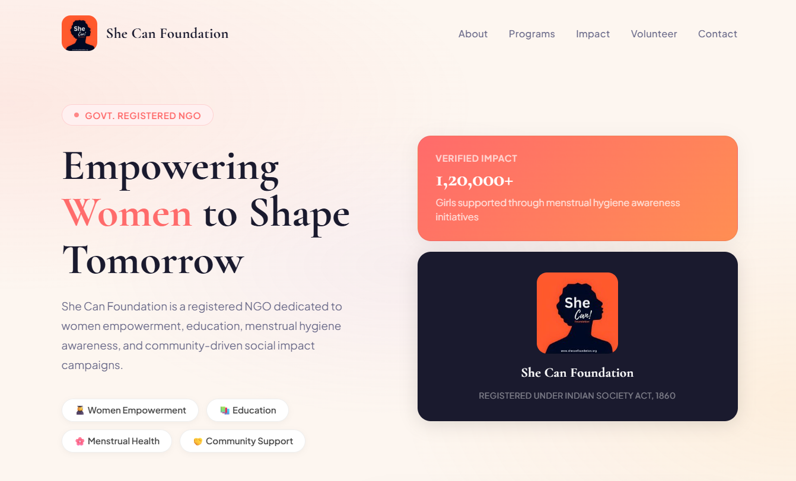
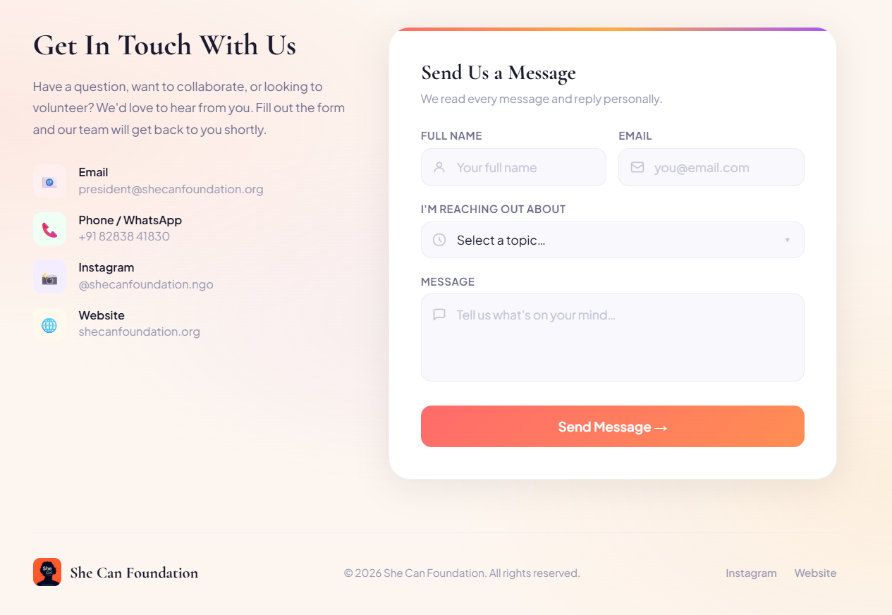

# She Can Foundation - Contact Form Website

A responsive, visually rich website built for **She Can Foundation** as part of the Full Stack Development Internship selection task.

---

## 🌐 Live Preview

> Open `index.html` directly in any browser.

---

## 📸 Screenshots

---

## 📋 Task Requirements Fulfilled

| Requirement                             | Status     |
| --------------------------------------- | ---------- |
| Name Field                              | ✅         |
| Email Field                             | ✅         |
| Message Field                           | ✅         |
| Submit Button                           | ✅         |
| "Form Submitted Successfully" on submit | ✅         |
| Form Validation                         | ✅ (bonus) |
| Responsive Design                       | ✅ (bonus) |

---

## ✨ Features

- **Full contact form** with Name, Email, Subject dropdown, and Message fields
- **Client-side form validation** with inline error messages
- **Success state** - displays "Form Submitted Successfully" after valid submission
- **Responsive layout** - works on mobile, tablet, and desktop
- **Modern UI** - glassmorphism cards, gradient accents, smooth animations
- **NGO sections** - Navbar, Hero with impact stats, Contact info, Footer

---

## 🛠️ Tech Stack

- HTML5
- CSS3 (animations, gradients, responsive grid)
- Vanilla JavaScript (form validation, DOM manipulation)

> No frameworks. No dependencies. No database required. Works out of the box.

---

## 🚀 How to Run

1. Clone or download this repository
2. Open `index.html` in any web browser
3. That's it - no setup needed!

---

## 👩‍💻 Built By

Made as part of the **She Can Foundation Full Stack Development Internship** selection task.

---

## 🌸 About She Can Foundation

She Can Foundation is a youth-driven NGO working towards creating opportunities, awareness, and positive social impact through education, digital initiatives, and community-driven programs.

- 🌐 Website: [shecanfoundation.org](https://shecanfoundation.org)
- 📸 Instagram: [@shecanfoundation.ngo](https://www.instagram.com/shecanfoundation.ngo)
